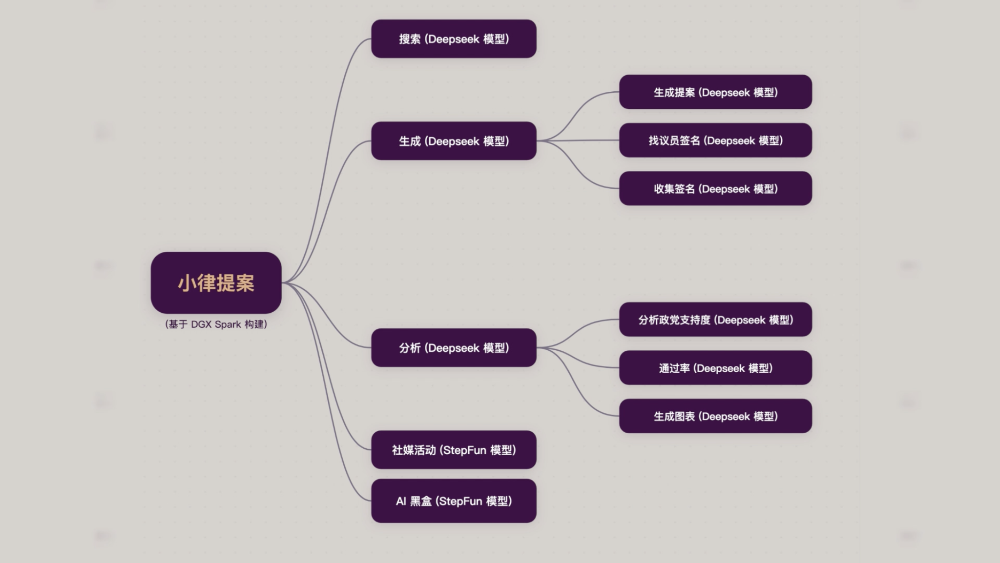
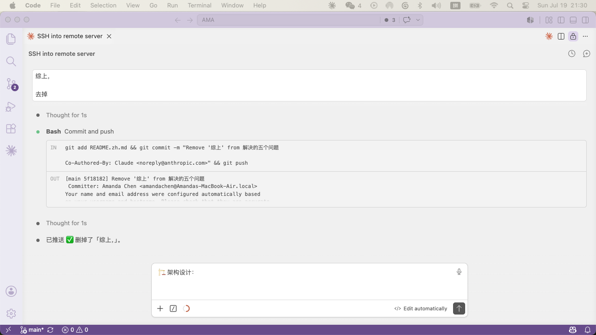

# Leges: One lex at a time

<p align="center">
  
</p>

### AI legislating for AI — machines drafting laws for machines, 24/7

---

## 📖 Origin

AI technology is advancing at breakneck speed, and AI legislation is accelerating worldwide. During my internship with a California State Assemblymember, I discovered a gap in the legislative process:

|   | Problem | Reality |
|---|---------|---------|
| 1 | No roadmap | AI legislation races ahead with no playbook for lawmakers |
| 2 | Language wall | Ordinary people can't read, let alone write, a bill |
| 3 | Cross-jurisdictional silos | No tools exist to compare laws across regions |
| 4 | Reactive, not proactive | Governments only act after a crisis hits |
| 5 | Insider-only | The people most affected have no seat at the table |

If we fight fire with fire, can AI legislate for AI?

To answer that, I built **Leges**.

---

## 🎯 Five Problems — Five Solutions

Leges addresses the five critical problems of global AI legislation:

| # | Problem | Solution |
|---|---------|----------|
| 1 | Governments don't know where to start | One-click legislative templates — anyone can draft professional bills |
| 2 | Bill language is a barrier | Clear cross-jurisdictional search results — no language barriers |
| 3 | Cross-jurisdictional silos | Tri-jurisdiction unified search breaks information silos |
| 4 | Reactive, not proactive | AI Black Box proposes bills 24/7, proactively |
| 5 | AI policy can't be insider-only | Search→Draft→Analyze→Petition→Social — city-wide civic engagement |

---

## ✨ Key Highlights

### 1. Dual-Mode Legislation — Human + Autonomous

**Human-guided chain:**
Search existing bills → Generate draft → Analyze pass rates → Social campaign — a complete legislative advocacy loop. Each Agent works standalone or in sequence.

**Autonomous Black Box:**
The world's first 24/7 non-stop AI legislation engine. Zero human intervention, continuously generating AI policy bills.

### 2. Cross-Jurisdictional Intelligence

Simultaneously leverages three fundamentally different institutional environments — Hong Kong (executive-led), Macau (prior written approval by the Chief Executive), and California (bipartisan competition) — for retrieval and generation, forming a unique **institutional spectrum** research framework.

### 3. Legislative Transparency

Empowering ordinary people to participate in the legislative process — search precedents, draft bills, analyze success rates, launch petitions, promote via social media — every step AI-assisted.

---

## 🎬 Complete Feature Tour

From a personal concern to a city-wide petition, Leges builds a complete legislative participation chain.

### Step 1: Search — Cross-Jurisdictional Precedent Retrieval

Enter a topic in the dashboard search to retrieve relevant past bills. Then use the **Search Agent** for deeper cross-jurisdictional search — focus on a specific region (Hong Kong/Macau/California) or search across all jurisdictions at once. The system returns precise bill counts and detailed lists.

### Step 2: Generate — AI Drafting + Legislator Matching + Petition

The **Generate Agent** lets you draft professional bills from a topic. Three tailored length modes — **Standard**, **Detailed**, and **Simple**. Pick a mode, click generate, and moments later a tightly-formatted bill with complete legal provisions appears.

It also includes two core subagents:

- **Legislator Match Subagent**: Automatically searches historical proposal data to match legislators who have supported similar bills and may support yours
- **Petition Subagent**: One-click petition launch to collect public signatures, with real-time display of the latest signatories

From bill drafting to legislator lobbying to public opinion gathering — a complete closed loop.

### Step 3: Analysis — Pass Rate Simulation

The **Analysis Agent** runs quantitative pass-rate simulations with three core subagents:

- **Chart Analysis Subagent**: Generates intuitive prediction charts showing each party's projected support rate
- **Party Analysis Subagent**: Dissects each party's voting tendencies and stance breakdown
- **Overall Pass Rate Subagent**: Evaluates the overall pass rate and outputs a detailed report pinpointing the bill's core strengths and potential obstacles

### Step 4: Social — Amplify Impact

The **Social Agent** automatically sets signature targets and comes with six copywriting templates. By injecting platform-specific tone guidelines as system prompts, the AI generates promotional content adapted for different social platforms — whether visual-focused Instagram or influencer-style Xiaohongshu (RedNote). The complete loop from individual civic concern to city-wide engagement is achieved.

### Step 5: AI Black Box — 24/7 Autonomous Legislation

At the heart of the platform: the **AI Black Box**. Here, an AI-driven autonomous legislation flow operates 24/7, tirelessly detecting emerging tech vulnerabilities and continuously generating new bill drafts — with zero human input required. The system autonomously evolves and generates complete bills, integrating them in real-time with fresh timestamps.

In summary:

| Agent | Role | Input → Output |
|-------|------|---------------|
| 🔍 Search | Bill retrieval | Natural language → Similar bills with relevance scores |
| ✎ Generate | Bill drafting | Topic + style → Full draft + legislator recommendations + petition |
| 📊 Analysis | Pass rate prediction | Bill topic → Pass rate % + party breakdown + chart |
| 📣 Social | Social campaign | Bill info → Platform-adapted posts with petition CTA |
| 📦 AI Black Box | Autonomous legislation | No input → Continuous AI bill generation |

---

## 🤖 Dual-Engine Architecture

The public-facing **Social Agent** and the autonomous **AI Black Box** are powered by **StepFun 阶跃星辰** models. The legally rigorous **Search**, **Generate**, and **Analysis Agents** are fully integrated with **Deepseek** models. A dual-engine powerhouse, backed by the full-stack compute capability of **NVIDIA DGX Spark**, that makes Leges' full automation possible.

---


---

## 🏗️ Architecture

<p align="center">
  
</p>

| Layer | Technology |
|-------|-----------|
| 🖥️ Frontend | Web UI (HTML+JS) |
| ⚙️ Backend | FastAPI |
| 🤖 Agents | 🔍 Search · ✎ Generate · 📊 Analysis · 📣 Social · 📦 AI Black Box |
| 🧠 AI Engine | Deepseek API (Anthropic-compatible) |
| 📚 Data | Legislative Corpora (Hong Kong / Macau / California) + 384-dim Vector Embeddings |

<p align="center">
  
  <br><em>Leges Architecture Mindmap</em>
</p>

---

## 🤖 Agent Integration & Model Optimization

### Multi-Agent Coordination

Each Agent independently calls the Deepseek LLM via structured prompt engineering:

- **Search Agent**: 384-dim vector embeddings for semantic retrieval; auto-translates Chinese queries to English
- **Generate Agent**: Three-part prompts (role + task + format constraints) with Standard/Detailed/Simple output levels
- **Analysis Agent**: Three-stage quantitative simulation (chart analysis + party analysis + overall pass rate), structured output for prediction charts and assessment reports
- **Social Agent**: 6 template angles (problem-solution, hot topic, journey story, community, goal progress, urgency); platform tone guides injected as system prompts
- **Black Box**: 25 AI policy topics in a rotating pool; 3-6 second intervals for unsupervised autonomous generation

### Optimization

- Precise prompt engineering (role setting, output format, language enforcement) reduces hallucinations
- Language isolation: English/Chinese modes each have forced language directives to prevent code-switching
- Vercel serverless deployment with optimized cold starts and 90-120s API timeouts for long-form generation

---

## 🛠️ Tech Stack

| Layer | Tech | Notes |
|-------|------|-------|
| Backend | Python / FastAPI | Lightweight async web framework |
| Frontend | Static HTML + Vanilla JS | Zero dependencies, direct rendering |
| AI Inference | Deepseek (Anthropic-compatible API) + StepFun | Social Agent & Black Box use StepFun |
| Vector Search | NumPy + cosine similarity | 384-dim semantic bill search |
| Deployment | Vercel (`@vercel/python`) | Serverless rapid deployment |
| Data | 3-jurisdiction legislative corpora | Hong Kong (LegCo) + Macau + California (leginfo) |

### NVIDIA & Third-Party Tools

- **NVIDIA SDK**: Full DGX Spark platform integration
- **Stepfun 阶跃星辰**: Companion LLM support
- **Deepseek v4**: AI inference via Anthropic-compatible API

---

## ⚡ Deployment

### Local (DGX Spark)

```bash
# 1. Clone
git clone https://github.com/your-username/leges.git
cd leges

# 2. Install
pip install -r requirements.txt

# 3. Configure
export ANTHROPIC_AUTH_TOKEN="your-api-key"
export ANTHROPIC_BASE_URL="https://api.deepseek.com/anthropic"
export ANTHROPIC_MODEL="deepseek-v4-flash"

# 4. Launch
uvicorn web.routes:app --host 0.0.0.0 --port 8000

# 5. Open http://localhost:8000
```

### LLM Optimization on DGX Spark

- Prompt template caching reduces redundant API calls
- Pre-computed vector embeddings (`data/embeddings.npy`) loaded at startup — no real-time inference needed
- HTTP connection reuse (httpx Client) minimizes handshake overhead

### Vercel Deployment

```bash
npm_config_cache=/tmp/npm-cache npx vercel --name leges-app --prod
```

---

## 📁 Project Structure

```
├── web/
│   ├── routes.py          # FastAPI routes (all Agent endpoints)
│   └── static/
│       └── index.html      # Single-page frontend
├── engine/
│   └── config.py           # Jurisdiction/language/preset config
├── data/
│   ├── embeddings.npy      # Bill vector embeddings
│   └── bill_metadata.json  # Bill metadata index
├── output/                 # Legislative data files
├── DESIGN.md               # Design system documentation
├── pyproject.toml          # Python project config
├── vercel.json             # Vercel deployment config
└── requirements.txt        # Dependencies
```

---

## 🎯 Judging Criteria

| Criterion | Weight | Our Approach |
|-----------|--------|-------------|
| Practicality, Industry Value & Innovation | 25% | AI legislation fills a real gap; dual-mode (human/auto) innovation; cross-jurisdictional institutional spectrum framework |
| Agent Integration & Model Optimization | 25% | 5 Agents in collaboration; structured prompt engineering; vector semantic search; 24/7 autonomous generation |
| Project Completeness | 20% | Full frontend + backend; all 5 Agents functional; i18n bilingual; comprehensive documentation |
| Platform Adaptation | 15% | DGX Spark full-stack; NVIDIA SDK + Stepfun model integration |
| Demo Quality | 10% | Video showcasing all 5 Agents + Black Box end-to-end |
| Written Record | 5% | "Ten Days Talk" development journey |

---

## 🔮 Roadmap

- **Always-on**: Black Box runs 24/7, continuously proposing AI legislation
- **Periodic refresh**: Search / Generate modules refresh every few months with new data and UX
- **Multi-jurisdiction**: Expand to more legislative bodies
- **Multi-API integration**: Support more LLM APIs (Social Agent & Black Box already use StepFun)

---

## 🎨 Design System

Full color palette and component specs in [DESIGN.md](DESIGN.md).

---

## 👥 Team

*(Team photo goes here)*

---

## 📹 Demo Video

*(Demo video link goes here)*

---

## 📄 Open Source

This project is open source. Issues and PRs welcome.

---

*Built for DGX Spark Hackathon 2026 · "Ten Days Talk" Development Chronicle*
